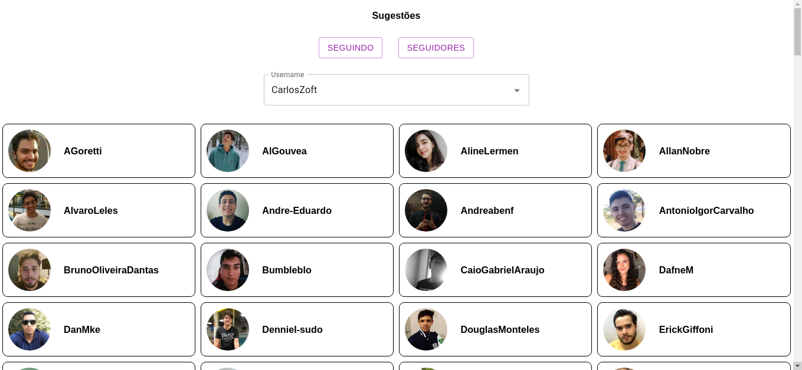
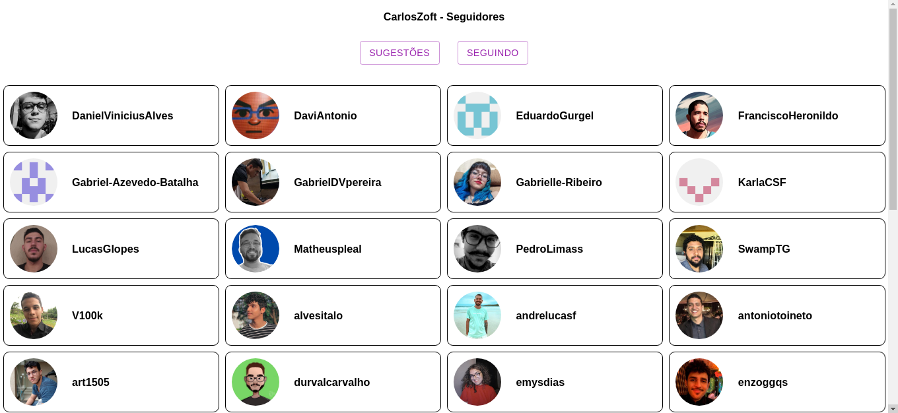
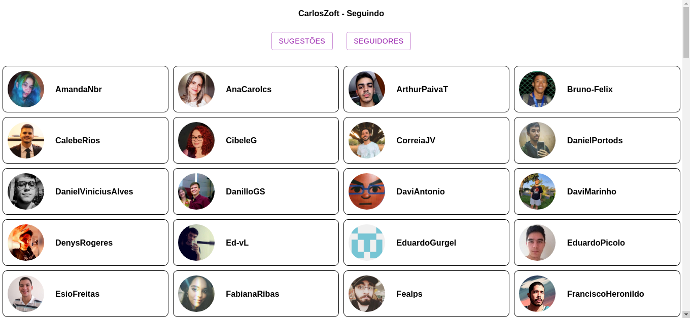

# Follow Suggestion

**Número da Lista**: 29<br>
**Conteúdo da Disciplina**: Grafos 2<br>

## Alunos

| Matrícula  | Aluno                              |
| ---------- | ---------------------------------- |
| 18/0118005 | Carlos Rafael Vasconcelos de Matos |
| 20/0021541 | Karla Chaiane da Silva Feliciano   |

## Sobre

O Projeto consiste na sugestão de conexões do Github de pessoas que estão dentro da [organização da disciplina](https://github.com/projeto-de-algoritmos). Utilizando o algoritmo de [Kosaraju's](https://en.wikipedia.org/wiki/Kosaraju%27s_algorithm) para encontrar componentes fortemente conectados, e sugerir os membros do grupo.

## Screenshots





## Instalação

**Linguagem**: JavaScript<br>
**Framework**: React<br>

#### Pré requisitos

É necessária a instalação do nodejs

- [Node v16.17.0+](https://nodejs.org/en/)

#### Passos

Entre na pasta **frontend**

```terminal
cd frontend
```

Instale as dependencias do projeto:

```terminal
npm install
```

Para executar o projeto:

```terminal
npm start
```

## Uso

Depois da execução; a aplicação estará disponivel na porta 3000

http://localhost:3000/

## Informações Adicionais

O projeto utiliza **dados estáticos**, por questões de de [**rate limit**](https://en.wikipedia.org/wiki/Rate_limiting) da API do Github (fornecedor dos dados utilizados na aplicação).

A **amostra de contribuidores** foi construida com base nos contribuidores dos repositórios da [**organização**](https://github.com/projeto-de-algoritmos).
